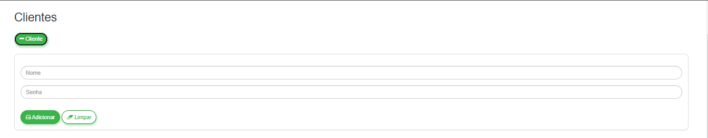
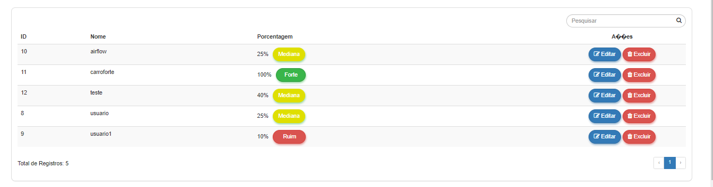
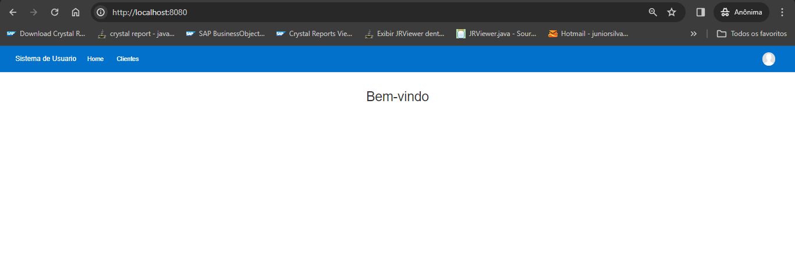
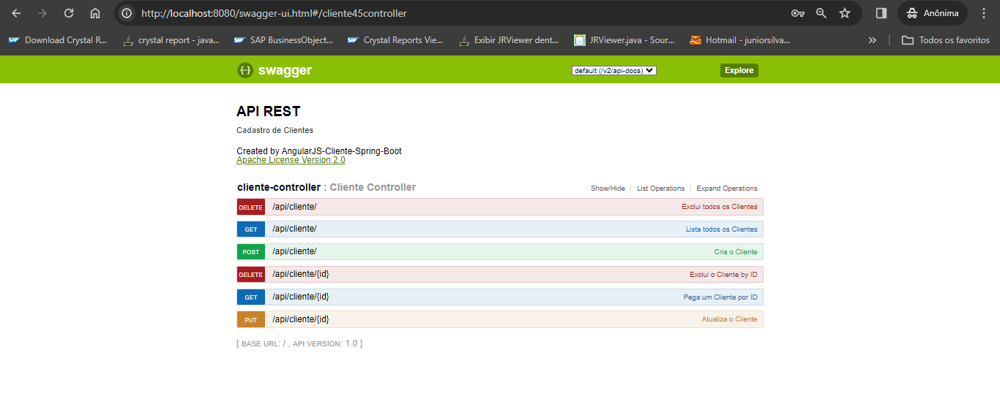

# Sistema de Cliente

Projeto de crud clientes, desenvolvido em Java com Spring-Boot.

## Características

- CRUD
- API RESTful
- ACL
- Validation
- Filter
- Pagination
- Responsive
- JUnit

## Requisitos

- Java JDK 1.8
- Apache Maven >= 3.5.4
- MySql >=5

## Tecnologias

- Java
- JPA
- Maven
- Spring
- Swagger
- CSS
- Jquery
- Bootstrap
- AngularJS
- MySql

## Instalação

```
$ git clone https://github.com/dorvanojr/spring-cliente-angularjs-app.git

$ cd angularjs-spring-boot

```

Crie um banco de dados com o nome "dbc" no seu Mysql. Você encontra o dump na raiz do projeto (dbc.sql) e pode efetuar importação da seguinte forma:

```
$ mysql -u <your user> -p <your password>

mysql> create database `dbc`;

mysql> use `dbc`;

mysql> source dbc.sql

```

Depois abra o arquivo "src/main/resources/application.properties" e coloque os dados de acordo com a conexão do seu banco de dados. <br>

Ao concluir a configuração, basta digitar no terminal:

```
$ mvn spring-boot:run
``` 

Aguarde carregar todo o serviço web. <br>
Após concluído, abra o seu navegador o seguinte endereço: <br>

http://localhost:8080/


## Swagger 

Documentação da API RESTful: <br>

http://localhost:8080/swagger-ui.html#/

## Licença

User Registration is licensed under <a href="LICENSE">The MIT License (MIT)</a>.

## Screenshots

<br><br>
<br><br>
<br><br>


## Swagger
<br><br>


Desenvolvido por<br>
Dorvano Junior<br>
dorvanojr@gmail.com<br>
https://github.com/dorvanojr<br>
